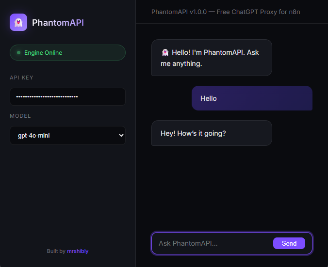
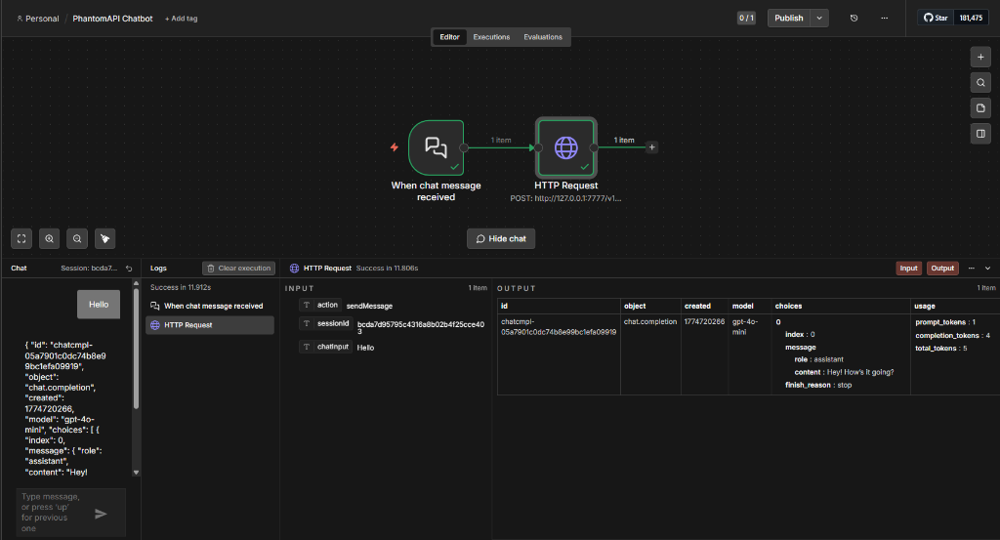

<div align="center">

# 👻 PhantomAPI

### Turn ChatGPT into a FREE OpenAI-Compatible API

[](https://fastapi.tiangolo.com/)
[](https://playwright.dev/)
[](https://docker.com/)
[](LICENSE)

**The invisible proxy that bridges ChatGPT's free web interface with your AI automation workflows.**

[Quick Start](#-quick-start) · [n8n Integration](#-connecting-to-n8n) · [Architecture](#-architecture) · [Docker](#-docker-deployment)

</div>

<div align="center">
  <video src="demo.mp4" width="800" controls muted autoplay loop></video>
</div>

---

## 🌟 What is PhantomAPI?

**PhantomAPI** is a high-performance proxy server that makes ChatGPT's free web interface behave like the official OpenAI API. It's designed as a **drop-in replacement** for any tool that speaks the OpenAI protocol — especially **n8n**.

### ✨ Key Features

| Feature | Description |
|:---|:---|
| 💸 **Zero API Costs** | Uses ChatGPT's free web interface via headless browser automation |
| ⚡ **Async Architecture** | Built on FastAPI with a dedicated browser thread for non-blocking requests |
| 🤖 **AI Agent Support** | Full tool-calling / function-calling support for n8n Agent nodes |
| 🔒 **API Key Auth** | Protected with Bearer token authentication |
| 🐳 **Docker Ready** | Deploy in seconds with `docker-compose up` |
| 🎨 **Built-in GUI** | A sleek dark-mode chat interface for quick testing |
| 📐 **Clean Architecture** | Proper FastAPI structure — routers, schemas, services, utils |

---

## ⚙️ How It Works

```
┌──────────┐     HTTP/JSON      ┌──────────────┐     Playwright     ┌──────────────┐
│   n8n    │ ──────────────────▶ │  PhantomAPI  │ ──────────────────▶ │  ChatGPT     │
│  (or any │ ◀────────────────── │  (FastAPI)   │ ◀────────────────── │  (Web UI)    │
│  client) │   OpenAI Schema     │              │   Scrape Response   │              │
└──────────┘                     └──────────────┘                     └──────────────┘
```

1. **You send** a standard OpenAI API request to PhantomAPI
2. **PhantomAPI** formats your messages into a prompt and types it into ChatGPT's web interface using a stealth browser
3. **ChatGPT responds** on the web page — PhantomAPI scrapes the text
4. **The response** is formatted back into the official OpenAI JSON schema and returned to you

---

## 🎨 Preview

<div align="center">
  
</div>

---

## 🛠️ Quick Start

### Prerequisites
- **Python 3.10+**
- **Google Chrome** installed on your system

### 1. Clone & Install

```bash
git clone https://github.com/mrshibly/phantom-api.git
cd phantom-api
pip install -r requirements.txt
python -m playwright install chromium
```

### 2. Configure

```bash
cp .env.example .env
# Edit .env and set your API_SECRET_KEY
```

### 3. Run

```bash
python run.py
```

The server will start on `http://localhost:7777`.

| Endpoint | Description |
|:---|:---|
| `http://localhost:7777/` | Health check |
| `http://localhost:7777/docs` | Swagger UI (interactive API docs) |
| `http://localhost:7777/gui` | Chat GUI for quick testing |

---

## 🔌 Connecting to n8n

<div align="center">
  
</div>

### Method 1: OpenAI Node (Recommended)

1. In n8n, go to **Credentials → New → OpenAI API**
2. Set **Base URL** to: `http://127.0.0.1:7777/v1`
3. Set **API Key** to your `API_SECRET_KEY` from `.env`
4. Use this credential in any **OpenAI** or **AI Agent** node

> **Docker Tip:** If n8n runs in Docker, use `http://host.docker.internal:7777/v1`

### Method 2: HTTP Request Node

1. Add an **HTTP Request** node
2. **Method:** `POST`
3. **URL:** `http://127.0.0.1:7777/v1/chat/completions`
4. **Authentication:** Header Auth → `Authorization: Bearer YOUR_KEY`
5. **Body (JSON):**

```json
{
  "model": "gpt-4o-mini",
  "messages": [
    { "role": "user", "content": "Hello, PhantomAPI!" }
  ]
}
```

---

## 📐 Architecture

```
phantom-api/
├── app/
│   ├── main.py              # App factory, CORS, lifespan
│   ├── config.py            # Environment-driven settings
│   ├── dependencies.py      # Auth dependency injection
│   ├── api/v1/
│   │   ├── router.py        # Route aggregator
│   │   ├── chat.py          # POST /v1/chat/completions
│   │   ├── responses.py     # POST /v1/responses
│   │   └── models.py        # GET  /v1/models
│   ├── schemas/
│   │   ├── chat.py          # Request/Response models
│   │   └── responses.py     # Responses API models
│   ├── services/
│   │   └── browser.py       # Playwright browser engine
│   └── utils/
│       ├── prompt.py         # Smart prompt builder
│       └── parser.py         # Tool-call JSON parser
├── static/
│   └── index.html            # Chat GUI
├── tests/
│   └── test_health.py        # Endpoint tests
├── Dockerfile
├── docker-compose.yml
├── requirements.txt
├── .env.example
└── run.py                    # Entry point
```

---

## 🐳 Docker Deployment

```bash
# Build and run
docker-compose up --build -d

# The server is now running on http://localhost:7777
```

---

## 🔧 API Reference

### `POST /v1/chat/completions`

Standard OpenAI Chat Completions endpoint. Supports messages, tools, and function calling.

### `POST /v1/responses`

Modern Responses API for newer n8n versions. Accepts `input` (string or messages) and optional `instructions`.

### `GET /v1/models`

Returns available model identifiers (used by n8n's model dropdown).

### `GET /`

Health check — returns server status and version.

---

## 📄 License

This project is open-sourced under the [MIT License](LICENSE).

---

<div align="center">

**Built with ❤️ by [mrshibly](https://github.com/mrshibly)**

</div>
